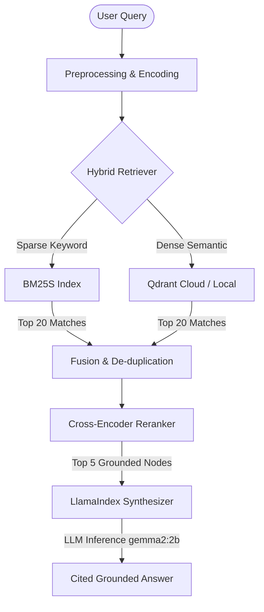

# 🧠 ArXiv Research Assistant

> A premium RAG-powered research platform providing cited, grounded answers over machine learning papers — tailored for ML engineers.

[](https://github.com/run-llama/llama_index)
[](https://qdrant.tech/)
[](https://fastapi.tiangolo.com/)
[](https://nextjs.org/)

---

## 🧭 Overview

**ArXiv Research Assistant** is an advanced, production-grade Retrieval-Augmented Generation (RAG) system. Unlike generic AI wrappers, it integrates a sophisticated hybrid search strategy (sparse BM25 + dense vectors) with a Cross-Encoder reranking pipeline to yield highly accurate context, generating grounded answers complete with interactive inline citations.



---

## ✨ Features

* **🔍 Hybrid Search Engine:** Merges keyword matches (via BM25S) and semantic concepts (via dense vectors in Qdrant) to handle both jargon-heavy queries and conceptual questions.
* **🧬 Cross-Encoder Reranking:** Employs a `cross-encoder/ms-marco-MiniLM-L-6-v2` re-ranking step to calculate deep relevance between the query and retrieved context before LLM inference.
* **⚡ Live Pipeline Streaming:** The frontend displays real-time progress as it steps through dense encoding, vector retrieval, cross-encoder reranking, and generation.
* **📑 Clickable Citations:** Inline citation tags (e.g. `[1]`, `[2]`) are fully interactive; clicking them scrolls the view smoothly to the source paper card and flashes it with a glowing violet focus indicator.
* **🎛️ Parameters Panel:** Collapsible settings menu to dynamically toggle Cross-Encoder reranking and customize the number of retrieved papers (`Top-K`).
* **🍃 Zero Layout Shift (CLS):** Optimized Next.js 16 layout utilizing pre-loaded Google Fonts (`Inter` + `JetBrains Mono`) for a premium typography experience.

---

## 🛠️ Stack & Technologies

| Layer | Component | Details |
|---|---|---|
| **Orchestration** | **LlamaIndex** | RAG indexing, storage context, and response synthesis |
| **Vector DB** | **Qdrant** | High-performance vector index matching |
| **Keyword Search** | **BM25S** | Ultra-fast sparse retrieval index |
| **Reranking** | **HuggingFace Cross-Encoder** | Deep query-context relevance scoring |
| **Local LLM** | **Ollama (gemma2:2b)** | Private, local inference layer |
| **Backend API** | **FastAPI** | Uvicorn-hosted API server with async lifecycle hooks |
| **Frontend UI** | **Next.js 16 (React 19)** | High-fidelity Tailwind CSS design system with ambient glow |

---

## 🚀 Setup & Installation

### 1. Clone & Set Environment Variables
Copy the `.env.example` file to `.env` in the project root:
```bash
cp .env.example .env
```
Fill in your API keys in `.env` (supports Qdrant Cloud URL, credentials, OpenAI API key, or Ollama local endpoints).

### 2. Configure the Python Virtual Environment

> [!IMPORTANT]
> Ensure you activate the **root** virtual environment, not a nested subdirectory environment.

#### On Windows (PowerShell):
```powershell
python -m venv venv
.\venv\Scripts\Activate.ps1
pip install -r requirements.txt
```

#### On macOS/Linux:
```bash
python3 -m venv venv
source venv/bin/activate
pip install -r requirements.txt
```

---

## 🏃 Running the Application

The application requires running the backend FastAPI service and the frontend Next.js development server.

### 1. Start the Backend API
Make sure your virtual environment is active, then launch the FastAPI server from the `backend` folder:

```bash
# Navigate to the backend folder
cd backend

# Start the uvicorn API
python -m uvicorn app.main:app --reload --port 8000
```
> [!NOTE]
> The server automatically loads the `.env` configuration from the project root and establishes a connection to Qdrant Cloud.

### 2. Start the Frontend
In a new terminal window, navigate to the `frontend` folder, install the JavaScript packages, and start the development server:

```bash
cd frontend
npm install
npm run dev
```
Open [http://localhost:3000](http://localhost:3000) to view the interface.

---

## 🧪 Evaluation

System performance and hallucinations are evaluated using the **Ragas** framework. Standard metrics computed include:
* **Faithfulness:** Groundedness of the answer in the retrieved context.
* **Answer Relevancy:** Semantic match between user queries and answers.
* **Context Recall:** Coverage of ground-truth information by the retriever.

---

## ⚠️ Troubleshooting

### `ModuleNotFoundError: No module named 'llama_index'`
This occurs if Python executes from a global environment instead of the virtual environment. 
* **Fix:** Ensure you see `(venv)` at the beginning of your command prompt. If using PowerShell, run `.\venv\Scripts\Activate.ps1` in the root folder, and always invoke commands using `python -m uvicorn ...` to lock the execution path.

### `Address already in use` / `[Errno 10048] only one usage of each socket address`
An orphaned background task is holding the port (typically port 8000).
* **Fix (Windows):** Open PowerShell and run the following command to kill all dangling python tasks holding sockets:
  ```powershell
  taskkill /F /IM python.exe
  ```
  Alternatively, you can start the backend on port `8080` (e.g. `python -m uvicorn app.main:app --port 8080`) and update `NEXT_PUBLIC_API_URL` in `frontend/.env.local` to point to `http://localhost:8080`.

### `Qdrant client-server compatibility warning`
If you connect to Qdrant Cloud and see compatibility logs:
* **Resolution:** This is a non-blocking warnings log. The codebase skips version checks automatically and handles schema verification gracefully.